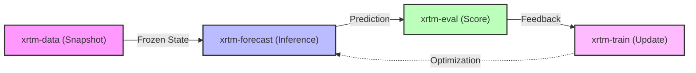

# The xrtm Framework

## The Problem

**Monolithic AI systems are impossible to evaluate.** When an AI system is a single black box that does everything—retrieval, reasoning, and generation—it is impossible to know *why* it failed. Was it a hallucination? Bad data? Poor reasoning?

## The Solution

**A rigorous, modular framework.** xrtm is a framework for probabilistic AI, composed of four interoperable libraries. This ensures that every step is verifiable, auditable, and optimizable.

## The Stack



| Layer | Package | Role | Install |
| :---: | :--- | :--- | :--- |
| 4 | **xrtm-train** | Backtesting, trace replay, calibration | `pip install xrtm-train` |
| 3 | **xrtm-forecast** | Orchestrator, agents, inference providers | `pip install xrtm-forecast` |
| 2 | **xrtm-eval** | Brier scores, ECE, trust primitives | `pip install xrtm-eval` |
| 1 | **xrtm-data** | Ground-truth schemas, temporal snapshots | `pip install xrtm-data` |

> **For most users**: `pip install xrtm-forecast` is sufficient—it automatically installs `xrtm-data` and `xrtm-eval`.
> **For researchers**: `pip install xrtm-train` installs the full stack including backtesting tools.

---

## Layer 1: xrtm-data

**The Snapshot Vault.**

`xrtm-data` provides the rigid schemas and temporal sandboxing infrastructure required for zero-leakage forecasting. It defines the "Ground Truth" data structures that the rest of the ecosystem relies on.

- **Zero Dependencies**: Foundation layer with no external xrtm imports
- **Forecast Object Standard**: Every prediction must include causal graphs and confidence intervals
- **Temporal Integrity**: `snapshot_time` enforces strict "End of History" for backtesting

---

## Layer 2: xrtm-eval

**The Judge.**

`xrtm-eval` is the rigorous scoring engine used to grade probabilistic forecasts. It operates independently of the inference engine to ensure objective evaluation.

- **Brier Score Breakdown**: Reliability, Resolution, Uncertainty
- **Expected Calibration Error (ECE)**: Measures gap between confidence and accuracy
- **Epistemic Trust Primitives**: Source verification and trust scoring

---

## Layer 3: xrtm-forecast

**The Runtime.**

`xrtm-forecast` is the professional engine for generative forecasting and agentic reasoning. It bridges rapid prototyping and mission-critical deployment.

- **Institutional Sovereignty**: Merkle reasoning, .xrtm manifests, source epistemics
- **Chronos Protocol**: Time-travel safe backtesting
- **Sentinel Protocol**: Dynamic trajectories for probability evolution
- **Advanced Reasoning**: Recursive consensus, fact-checking, orchestrator

---

## Layer 4: xrtm-train

**The Optimization Layer.**

`xrtm-train` closes the loop. It simulates history by replaying agents against past snapshots, scoring them with `xrtm-eval`, and optimizing their reasoning parameters.

- **Backtester**: Orchestrates simulation with strict temporal isolation
- **Calibration**: Adjusts confidence intervals to match reality
- **Trace Replay**: Re-run saved executions for debugging

---

## Quickstart

```python
from xrtm.forecast import AsyncRuntime, create_forecasting_analyst

async def main():
    # Instantiate the analyst
    agent = create_forecasting_analyst(model_id="gemini")
    
    # Execute reasoning loop
    result = await agent.run(
        "Will a general-purpose AI (AGI) be publicly announced before 2030?"
    )
    
    print(f"Confidence: {result.confidence}")
    print(f"Reasoning: {result.reasoning}")

if __name__ == "__main__":
    AsyncRuntime.run_main(main())
```
